# Cartpole system playground

This repo contains a simulation of a cartpole system with various control engineering stuff. It's meant to refresh a few concepts and test capabilities of Julia.

## Simple simulation from initial conditions

Function `simulate_cartpole()` to simulate cartpole system from initial conditions (stored in `CartPoleState`) with given parameters (stored in `CartPoleParams` struct). Examples:

Unforced:

```julia
cp_params = CartPoleParams(
    1.0, 0.5,   # w, h
    1.0, 0.3,   # mt, mp
    2.0,        # L
    0.2, 0.2    # bt, bp
)
init_state = CartPoleState(0.0, 0.0, pi - 0.3, 0.0)
diffeq_sol, saved_values = simulate_cartpole(cp_par, init_state, (x,t) -> 0.0, (0.0, 20.0), 0.01)
plot_sol_force(diffeq_sol, saved_values; dest_name = "simulation_unforced.png")
# to create also the gif
gif_sol(sol, CartPole(cp_params, init_state); dest_name = "simulation_unforced.gif")
```
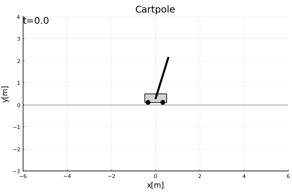
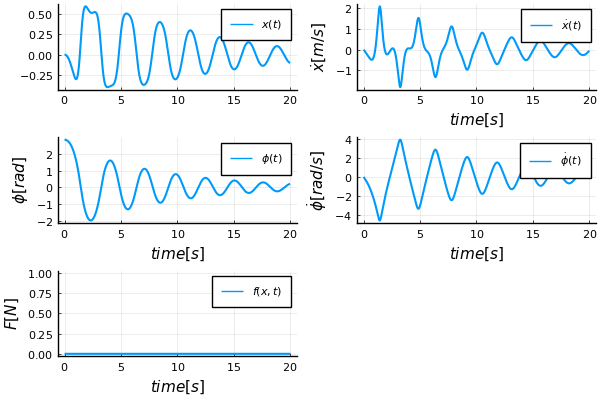

With some force applied and shorter pole:

```julia
cp_params = CartPoleParams(
    1.0, 0.5,   # w, h
    1.0, 0.3,   # mt, mp
    1.0,        # L
    0.2, 0.2    # bt, bp
)
init_state = CartPoleState(pi-0.3)  # convenient state ctor
f(x, t) = f_step(x, t; t_step_begin = 4, t_step_end = 6, weight = 0.3)
diffeq_sol, saved_values = simulate_cartpole(cp_params, init_state, f, (0.0, 20.0), 0.01)
plot_sol_force(diffeq_sol, saved_values; dest_name = "simulation_forced.png")
```
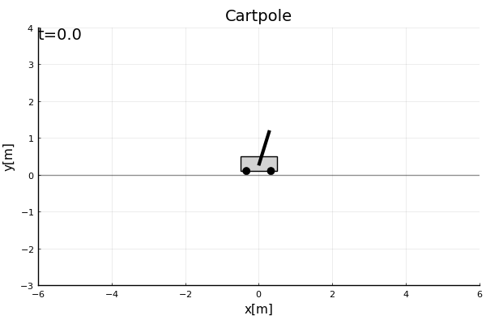
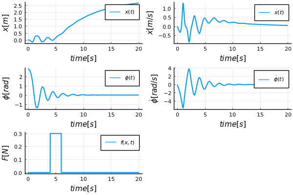

## Estimations

Estimation of all 4 states from a single noisy measurement of position `x`. The estimates are computed online via `SavingCallback` of the `DifferentialEquations` package, not offline from saved data as is usually done in examples. IMHO, online calculation is easier to understand and is closer to real application. A callback is chosen directly in the main function. The following callback estimators are implemented:
- Luenberger observer
- Linear Kalman Filter
- Extended Kalman Filter

```julia 
cp_params = CartPoleParams()
init_state = CartPoleState(pi-0.1)
main_estimator_cb(cp_params, init_state; make_plot=true)
```
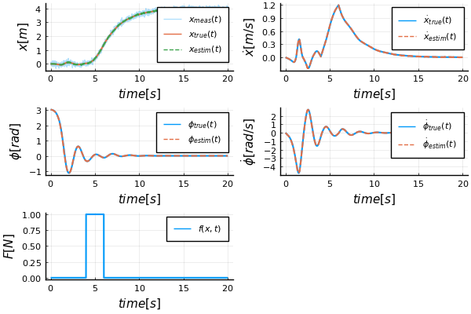

## LQR control

`ControlSystems` package is used to compute optimal gain matrix using `lqr` function. Example of recovery from bad initial position and subsequent push at time 10s:

```julia 
cp_params = CartPoleParams()
init_state = CartPoleState(pi-0.1)
main_LQR(cp_params, init_state; make_plot=true)
```
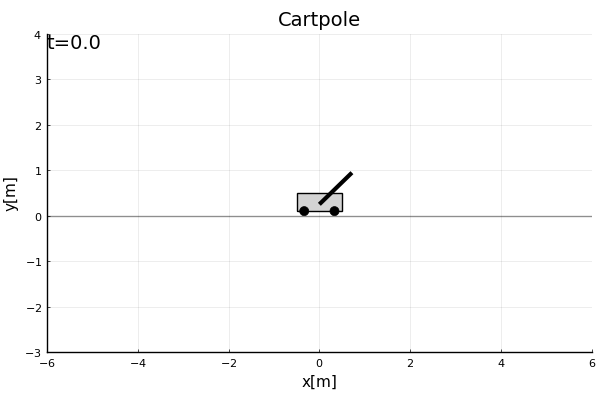
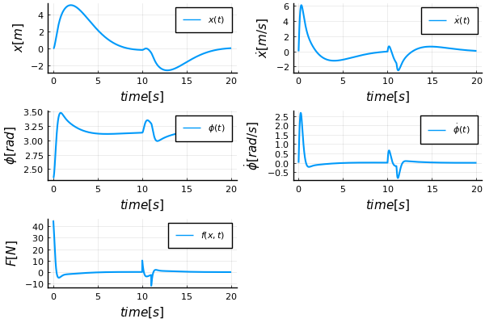

## Swing-up maneuver

### Using nonlinear optimization

`JuMP` package is used to impement direct collocation method implemented in `src/swingup_optim.jl`. A nice material for the method is in [An Introduction to Trajectory Optimization: How to Do Your Own Direct Collocation](https://epubs.siam.org/doi/10.1137/16M1062569)

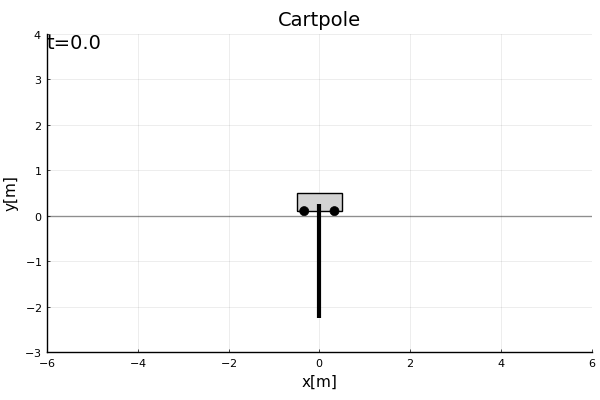
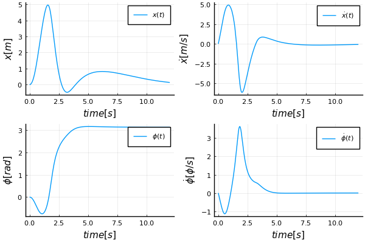

### Using reinforcement learning

Neural network with 4 inputs, 1 hidden layer and 1 output is trained using a cost function. `DiffEqFlux` package does the work. The code in `src/swingup_rl.jl` was highly inspired by [this Medium post by Paul Shen](https://medium.com/swlh/neural-ode-for-reinforcement-learning-and-nonlinear-optimal-control-cartpole-problem-revisited-5408018b8d71)

To reproduce the graph below, write the following:
```julia
cp_par = CartPoleParams()
init_state = CartPoleState()

# read the weights for neural net
nn_par = read_nn_params_json("assets/rl_ctrl_2022-04-23_16:30:10.json")
# simulate and produce plot
main_swingup_rl(cp_par, init_state, make_plot=true, nn_params=nn_par)
```
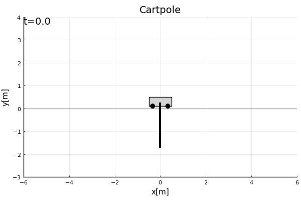
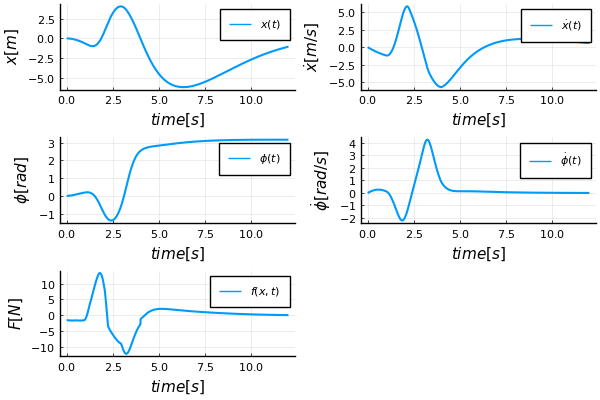


To train with different cost function or other parameters just exclude the `nn_params` argument, function will return trained net:
```julia
nn_trained = main_swingup_rl(cp_par, init_state, make_plot=true)

# to reuse:
main_swingup_rl(cp_par, init_state, make_plot=true, nn_params = nn_trained.u)
```
I found it very hard to pick the right cost function to do the job and not end up with something ridiculous, here are some failed attempts :D


This is what happens if LQR is not used at the top:


