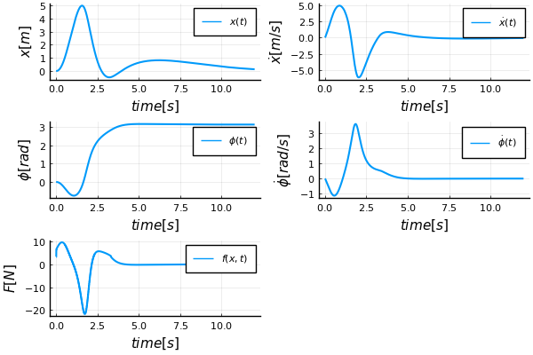

# Cartpole system playground

This repo contains a simulation of a cartpole system with various control engineering stuff. It's meant to refresh a few concepts and test capabilities of Julia.

## Simple simulation from initial conditions

Function `main_just_simulate()` to simulate cartpole system from initial conditions (stored in `CartPoleState`) with given parameters (stored in `CartPoleParams` struct). Examples:

Unforced:

With some force applied and shorter pole:

## Estimations

Estimation of all 4 states from a single measurement of position `x`.

## LQR control

Example of recovery from bad initial position and subsequent push at time 10s.

## Swing-up maneuver

### Using nonlinear optimization

### Using reinforcement learning
